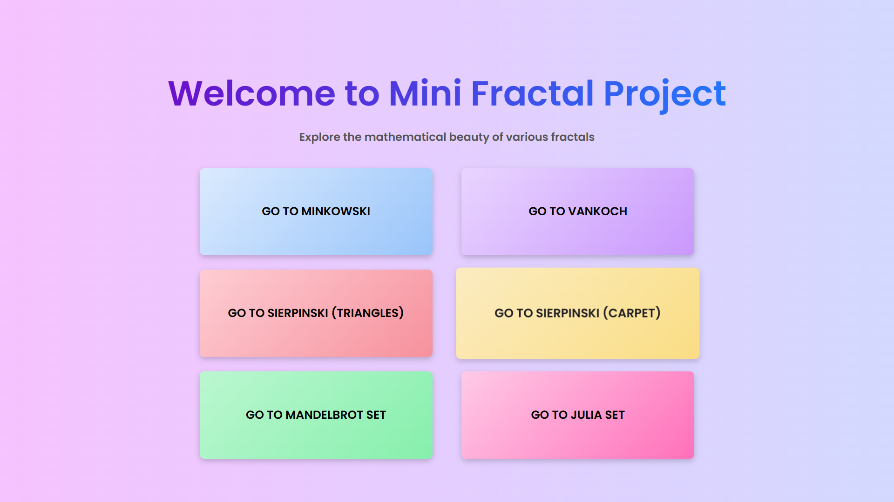

# CS105.Fractal

Dự án này là một phần của khóa học CS105, tập trung vào việc trực quan hóa và khám phá các fractal nổi tiếng bằng cách sử dụng HTML, CSS và JavaScript. Dự án cung cấp một giao diện tương tác để người dùng có thể khám phá các mô hình fractal khác nhau.

## 🧑‍🎓 Thành viên nhóm
- Phạm Hồ Trúc Linh - 22520777
- Huỳnh Trung Nghĩa - 22520945
- Nguyễn Hồng Phát - 22521702

## 📄 Nội dung 
Biểu diễn một số mô hình fractal phổ biến:
1.	Bông tuyết Vankoch (Koch Snowflake)
2. Đảo Minkowski (Minkowski Island)
3.	Tam giác Sierpinski (Sierpinski Triangles) và Hình vuông Sierpinski (Sierpinski Carpet)
4.	Mandelbrot Set và Julia Set

## 🚀 Cách chạy dự án

1. Clone repository về máy của bạn:
   ```bash
   git clone https://github.com/PHTLing/CS105.Fractal.git
   ```

2. Mở tệp `home.html` trong trình duyệt web của bạn.

3. Sử dụng giao diện để khám phá các fractal khác nhau.

## 🎨 Các công nghệ sử dụng

- HTML
- CSS
- JavaScript
- WebGL (trong thư mục `webgl/`)

## 📷 Hình ảnh minh họa



